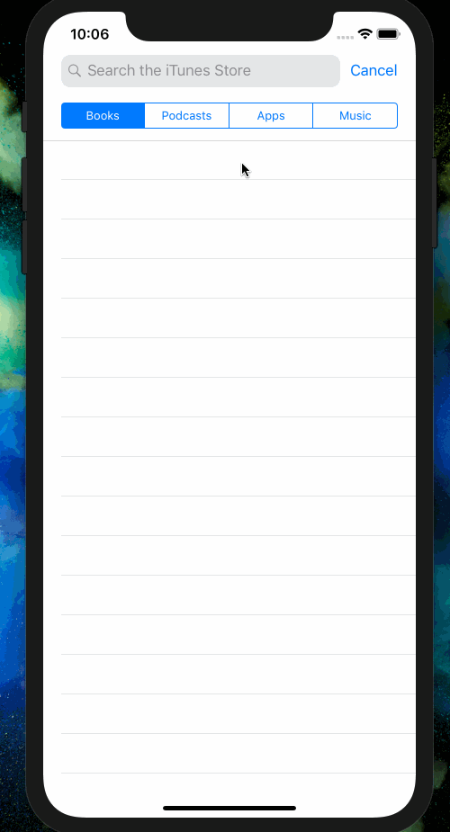

# App Development With Swift

Projects, playgrounds, and notes made while following along with Apple's book [_App Development With Swift_](https://itunes.apple.com/us/book/app-development-with-swift/id1219117996?mt=11).

## Project Portfolio

| Unit | Project | Topics Covered | Progress |
| :--: | :--------------------------: | :--------------: | :--------: |
| 1 - Getting Started | [Light](./01-getting-started/unit-project/Light): A minimalist flashlight app 🔦 | Xcode, Interface Builder, and connecting outlets and actions between them | ✅ |
| 2 - Intro to UIKit |  [Hello](./02-introduction-to-uikit/lesson-projects/Hello): An app for introducing someone. | Configuring views in Interface Builder :::: Customizing labels :::: Customizing image views | 🚧 |
| 2 - Intro to UIKit |  [Auto-Layout Calculator](./02-introduction-to-uikit/lesson-projects/Calculator) | Using nested vertical and horizontal stack views to display a calculator that fits lays out cleanly across size classes | ✅ |

 
 

  
  

 
 

| Unit | Project | Topics Covered | Progress |
| :--: | :--------------------------: | :--------------: | :--------: |
| 2 - Intro to UIKit | [Apple Pie](./02-introduction-to-uikit/unit-project): A hangman-style word guessing game | Building a game interface with nested vertical and horizontal stack views :::: Responding to events and updating complex interfaces based on game state changes | ✅ |

 
 

  
  

 
 

| Unit | Project | Topics Covered | Progress |
| :--: | :--------------------------: | :--------------: | :--------: |
| 3 - Navigation and Workflows | [Traffic Segues](./03-navigation-and-workflows/lesson-projects/TrafficSegues) | Using programmatic and Storyboard-based segues to construct multiple levels of view transitions :::: Reading segue identifiers :::: Different segue animations. | ✅ |

 
 

  
  
  

 
 

| Unit | Project | Topics Covered | Progress |
| :--: | :--------------------------: | :--------------: | :--------: |
| 3 - Navigation and Workflows | [Login](./03-navigation-and-workflows/lesson-projects/Login) | Using programmatic and Storyboard-based segues to orchestrate a login page flow. | ✅ |
| 3 - Navigation and Workflows | [Rainbow Tabs](./03-navigation-and-workflows/lesson-projects/RainbowTabs) | Relating a TabBarController to child view controllers and customizing the tab bar button icon for each  | ✅ |
| 3 - Navigation and Workflows | [Life Cycle](./03-navigation-and-workflows/lesson-projects/LifeCycle) | Debugging and viewing the lifecycle events of view controllers as they're called between two transitioning controllers  | ✅ |
| 3 - Navigation and Workflows | [Mythical Creature Personality Quiz](./03-navigation-and-workflows/unit-project/MythicalCreatureQuiz) | View Controller Containment :::: Encapsulating views in nib :::: communicating game state across controllers and transitions :::: More fun with stack views, Auto Layout, and interface controls 😀  | ✅ |

 
 

  
  
  

  
  

 
 

| Unit | Project | Topics Covered | Progress |
| :--: | :--------------------------: | :--------------: | :--------: |
| 3A - Building AR Apps with Xcode | [Surface Coater](./3A%20-%20-Building%20AR%20Apps%20with%20Xcode/lesson-projects/Surface%20Coater/) | Detecting vertical and horizontal planes in the world :::: Overlaying different colored planes on differently aligned surfaces | ✅ |
| 3A - Building AR Apps with Xcode | [AR Shots](./3A%20-%20-Building%20AR%20Apps%20with%20Xcode/lesson-projects/ARShots/): Shooting hoops with AR Objects and tap detection | Translating user taps into real-world positions :::: Placing 3D objects when discovered planes are selected :::: Adding physics to an AR scene :::: Positioning new objects relative to the camera's current position. | ✅ |
| 3A - Building AR Apps with Xcode | [AR Image Finder](./3A%20-%20-Building%20AR%20Apps%20with%20Xcode/lesson-projects/ARImageFinder/): Designing a treasure hunt game based upon pre-loaded reference images | Enabling image detection :::: Specifying which images to locate in the physical world :::: Responding to the discovery of an image :::: Performing simple animations with SceneKit objects | ✅ |
| 3A - Building AR Apps with Xcode | [AR Drawing](./3A%20-%20-Building%20AR%20Apps%20with%20Xcode/unit-project/ARKitDrawing/): Allow users to choose SceneKit shapes and models from menus and place them in their own scene. | Creating nodes from primitive shape settings :::: Loading nodes from a directory of `.scn` files :::: Changing rendering logic according to user control settings :::: Removing previously added nodes to "Undo" actions  | ✅ |
| 4 - Tables and Persistence | [Emoji Dictionary](./04-tables-and-persistence/lesson-projects/EmojiDictionary)| Creating grouped table with data sources and static tables via Storyboards :::: Allowing add/edit/delete functionality in a grouped table | ✅ |

 
 

  
  

 
 

| Unit | Project | Topics Covered | Progress |
| :--: | :--------------------------: | :--------------: | :--------: |
| 4 - Tables and Persistence | [Hotel Europa](./04-tables-and-persistence/lesson-projects/HotelEuropa): An app for hotel staff to register guests. | Building custom, intuitive, user-friendly forms to create new model objects and/or track important information. :::: Using custom protocols to pass data between view controllers. :::: How and when to use certain controls for collecting data. :::: Dynamically resizing table view cells. | ✅ |

 
 

  
  

 
 

| Unit | Project | Topics Covered | Progress |
| :--: | :--------------------------: | :--------------: | :--------: |
| 5 - Leveraging the Web | [MusicWireframe](./05-leveraging-the-web/lesson-projects/MusicWireframe): Wireframe of the Apple music app to implement button and player image animations. | Animating as a response to user interaction | ✅ |

 
 

  

 
 

| Unit | Project | Topics Covered | Progress |
| :--: | :--------------------------: | :--------------: | :--------: |
| 5 - Leveraging the Web | [ContestEntry](./05-leveraging-the-web/lesson-projects/ContestEntry): Animate based upon the current state of a form. | Animating a text field &mdash; or seguing if it has text | ✅ |

 
 

  

 
 

| Unit | Project | Topics Covered | Progress |
| :--: | :--------------------------: | :--------------: | :--------: |
| 5 - Leveraging the Web | [NASA Astronomy Photo of the Day](./05-leveraging-the-web/lesson-projects/NASAAstronomyPhotos): Displaying information from the NASA APOD API. | Building out a networking layer for asynchronously loading data. :::: Transforming raw `Data` into models and using them in views. :::: Using loading spinners to provide network activity feedback to users  | ✅ |

 
 

  

 
 

| Unit | Project | Topics Covered | Progress |
| :--: | :--------------------------: | :--------------: | :--------: |
| 5 - Leveraging the Web | [iTunes Search API](./05-leveraging-the-web/lesson-projects/iTunesSearch): Allow users to search the iTunes Search API for different media types and view their results in a table view. | Using `UISearchController` and scopes for filtering requests. :::: Architecting networking logic :::: Debouncing search tasks to allow for continuous typing in a search bar. :::: Updating the size of the URL cache to temporarily save images. | ✅ |

 
 

  

 
 

| Unit | Project | Topics Covered | Progress |
| :--: | :--------------------------: | :--------------: | :--------: |
| 5 - Leveraging the Web | [Restaurant Menu](./05-leveraging-the-web/unit-project/RestaurantMenu): An interactive menu for a restaurant that allows the customer to view a list of offerings, add items to an order, and submit the order to the restaurant. | Modeling data returning by a server API :::: Architecting networking logic :::: Lazilly fetching images from URL information :::: Maintaining "cart" state in a state controller :::: Dependency-injecting state controllers :::: Communicating loading events using NotificationCenter :::: Saving and restoring application state across app loads | ✅ |

 
 

  

 
 
